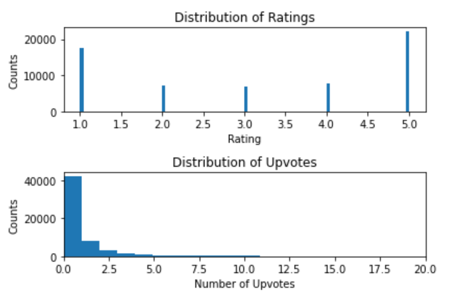

# Data Science Portfolio and Projects

by Oscar Wong

[**Project 1: Spotify Review NLP - Rating Prediction from Reviews on Google Play**](https://github.com/oscardata963/spotify_review)

The data was retrieved from https://www.kaggle.com/datasets/mfaaris/spotify-app-reviews-2022

This project aims at building an NLP machine that predicts the rating of the Spotify app based on the user reviews on Google Play. A recurrent neural network will be used. Side information such as the number of upvotes and the time of publication will also be used as features.

[**Project 2: Accommodation Price Prediciton: A Regression Task**](https://github.com/oscardata963/Acccommodation-Price-Prediction.git)

Accommodation costs share a significant portion of travellers' expenses. People always want to look for the best deals with rooms that fit their needs and preferences. However, with over thousands of choices over the Internet, people easily fall into a never-ending cycle of trying to manually targeting the best price. An intuitive and convenient solution to this common conundrum is to create a price estimator that does the cumbersome job for these travellers.

This project aims at building an accommodation price estimator that inputs relevant features about the stays and predicts their prices corresponding to these preferences. The collection of data requires web scraping on popular accommodation sites for a specific location, date and number of guests. To ensure consistency, the accommodations for 1 adult in Tokyo, Japan at a specific date will be explored and used as the input data.

